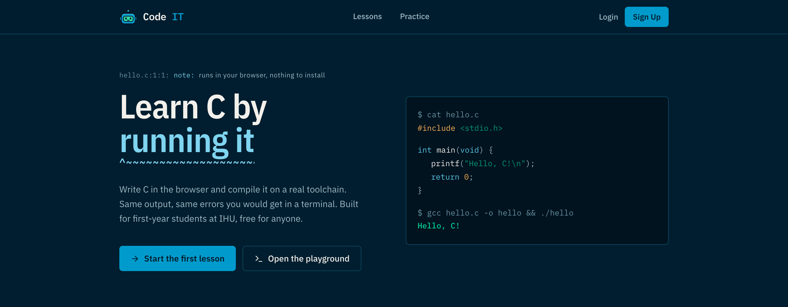

# CodeIT

Learn C by writing it and running it against a real compiler. Lessons follow the first-year C curriculum at International Hellenic University one short step at a time, and every code exercise is compiled and checked against expected output.

Live at [code-it.gr](https://code-it.gr).



## Why it exists

This started as a thesis project at IHU. First-year students get a single C course, and many of them reach the exam having barely written C outside of lectures. CodeIT covers the same topics in the same order as the course, so a student can practise the material from that week instead of working through a generic tutorial.

## How a lesson works

A lesson is a short sequence of steps, and each step is one of three kinds:

- Multiple choice, for concepts
- Fill in the blank, for syntax
- A code task, where you write C that gets compiled and run, and its output is compared against the expected result

Completing a lesson awards XP, which feeds levels and a daily streak. Guests can work through everything without an account, but nothing is saved until they sign up. All content exists in English and Greek, and lessons are authored through a built-in admin editor rather than being hardcoded.

## Stack

React 19 with React Router 7, bundled by Vite and styled with Tailwind 4. Supabase provides Postgres, authentication (email, Google, GitHub, and anonymous guests), and row-level security. Judge0, through RapidAPI, compiles and executes submitted C. Prism and react-simple-code-editor make up the editor, react-i18next handles translation, and the type is IBM Plex Sans with IBM Plex Mono.

## Code layout

```
src/
├── assets/         Images and Cody, the mascot
├── components/
│   ├── ui/         Reusable primitives (Button, Card, Input, PageHeading, ...)
│   ├── lesson/     Lesson screen subcomponents
│   ├── admin/      Admin editor subcomponents
│   ├── Header.jsx
│   ├── Footer.jsx
│   └── ProtectedRoute.jsx
├── context/        Authentication provider
├── hooks/          useAuth, useLang, useUserStats
├── lib/            Supabase client and data services
├── locales/        English and Greek translations
├── pages/          Route-level components
├── index.css       Tailwind theme and design tokens
└── main.jsx        Entry point
```

Each module in `src/lib` wraps a single concern: lessons, progress, statistics, code submission, and the Judge0 client. Shared state lives in `src/context` and `src/hooks`. The Supabase side is five tables, `lessons`, `progress`, `user_stats`, `submissions` and `profiles`, with row-level security enforcing per-user access.

## Design notes

The palette is sampled from Cody, the mascot: cyan `#009bcc` for primary actions, screen green `#05d299` for program output, navy `#001e2f` for the page, and a warm white `#f3f0eb` in place of pure white for text. Everything is defined as tokens in `src/index.css` and consumed through Tailwind, so there is no second theme file to keep in step.

Page titles are set as compiler diagnostics. A locus line like `lessons.c:1:1: note:` sits above the heading with a `^~~~~` caret run underneath it, which is what `PageHeading` renders.

Two constraints are worth knowing before changing anything typographic. IBM Plex Mono ships no Greek subset, so mono is reserved for content that is always Latin: code, file paths and digits. Translated captions use the `label` utility rather than `locus`, and Plex Sans backstops the mono stack so Greek can never drop through to a serif. Separately, C syntax colours are defined in `src/index.css` against those same tokens instead of being imported from a Prism theme, which is why the editor component pulls in no theme stylesheet.

## Running it locally

Node 18 or later.

```bash
npm install
npm run dev
```

The dev server comes up on `http://localhost:5173`. `npm run build`, `npm run preview` and `npm run lint` do what you would expect.

You also need a `.env.local` with your own credentials:

```
VITE_SUPABASE_URL=
VITE_SUPABASE_ANON_KEY=
VITE_JUDGE0_API_KEY=
```

One caveat: the database schema is not in this repository. A fresh clone builds and runs, but with an empty Supabase project behind it there are no lessons to load, so [code-it.gr](https://code-it.gr) is the only place to see the app working properly.

## Deployment

A static single-page app, currently on Netlify, with `public/_redirects` sending every path to `index.html` for client-side routing. The three environment variables have to be set in the host's configuration, since Vite inlines them at build time.

---

Theocharis Anesiadis · [GitHub](https://github.com/Anesiadis-Th) · [LinkedIn](https://www.linkedin.com/in/anesiadis-theocharis/)
